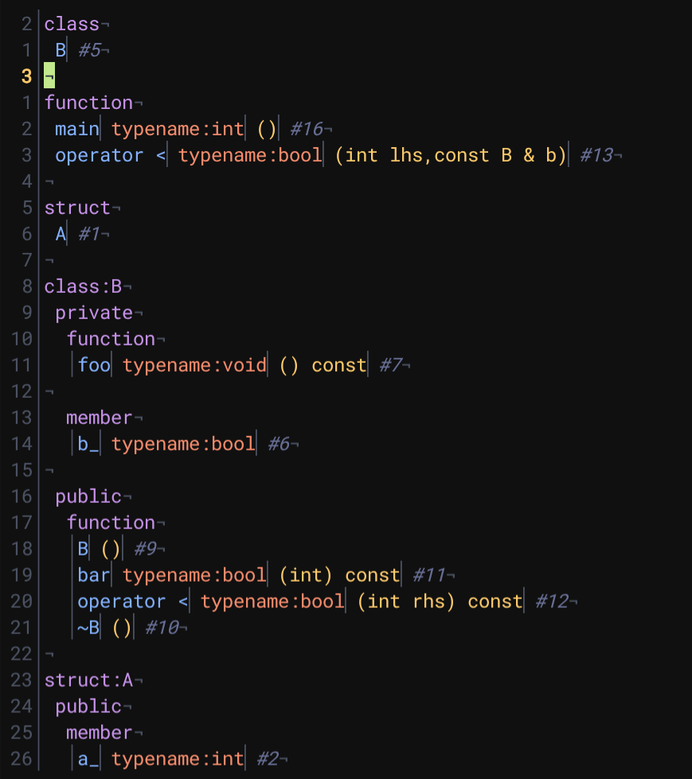

# src-outline.kak

**src-outline.kak** is a simple wrapper of [Universal Ctags](https://ctags.io/).
It shows the outline of a source file, and users can jump to the line in source file by pressing Enter.


## Installation

Please make sure you have [Universal Ctags](https://ctags.io/) installed.

For archlinux users:
``` sh
sudo pacman -S ctags
```

For Debian users:
``` sh
sudo apt install universal-ctags
```

### With [plug.kak](https://github.com/andreyorst/plug.kak)

Add this to the `kakrc`:
``` kak
plug "harryoooooooooo/src-outline.kak"
```
Then reload the configuration file or restart Kakoune and run `:plug-install`.

### Without plugin manager

This plugin has only one source file. `source`ing it in `kakrc` just works:

``` kak
source "/path/to/src-outline.kak/rc/src-outline.kak"
```

## Usage

When editing a support file type, type `:src-outline<ret>` to view the outline in a scratch buffer.
On the outline buffer, press Enter key to jump to the line in the source file.

To see the supported languages, run `ctags --list-languages`.

Sample source:
``` cpp
struct A {
  int a_;
};

class B : private A {
  bool b_;
  void foo() const {}
public:
  B() {}
  ~B() {}
  bool bar(int) const { return false; }
  bool operator < (int rhs) const { return a_ < rhs; }
  friend bool operator < (int lhs, const B& b) { return lhs < b.a_; }
};

int main() {}
```

Sample outline:

